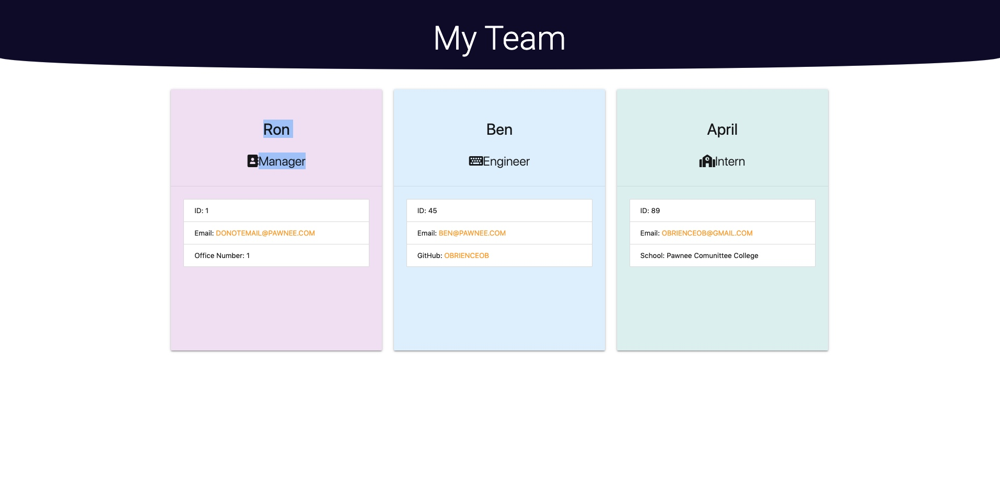

# Employee Profile Generator

## Description
This is a a Node.js command-line application that takes in information about employees on a software engineering team, then generates an HTML webpage that displays summaries for each person. There is also test scripts in this Repo to ensure the js files are working correctly

Here is an example HTML file generated from this application: 

## Table of Contents
* [Installation](#installation)
* [Usage](#usage)
* [License](#license)
* [Contributing](#contributing)
* [Tests](#tests)
* [Questions](#questions)

## Installation
To install dependencies, run the following:
`
npm i
`

## Usage
In order to run this repository, you will need to download the inquirer package, using the "npm install inquirer" command in your terminal, in the same repository the code is stored. Make sure you have your own package.json file created before installing the inquirer as a dependency. You will also need the jest package installed to run the tests. Use "npm install jest" to install. There are dependencies within the index.js main file on each of the classes defined in the other js files. The output of the index.js file will be in the /dist folder

Here is a link to a video show how to use the command line application: https://drive.google.com/file/d/1Gg8Wr0HYJ8HncuveL4GSd-AtfDjta83A/view?usp=sharing
## License
This repository is licensed under the MIT: (https://opensource.org/licenses/MIT) license.

## Contributing
Please fork this repo, and if I like your code I'll add it!

## Tests
To run tests, run the following:
`
npm run test
`

## Questions
Questions about this repository? Please contact me at [obrienceob@gmail.com](mailto:obrienceob@gmail.com). View more of my work in GitHub at [obrienceob](https://github.com/obrienceob) 
